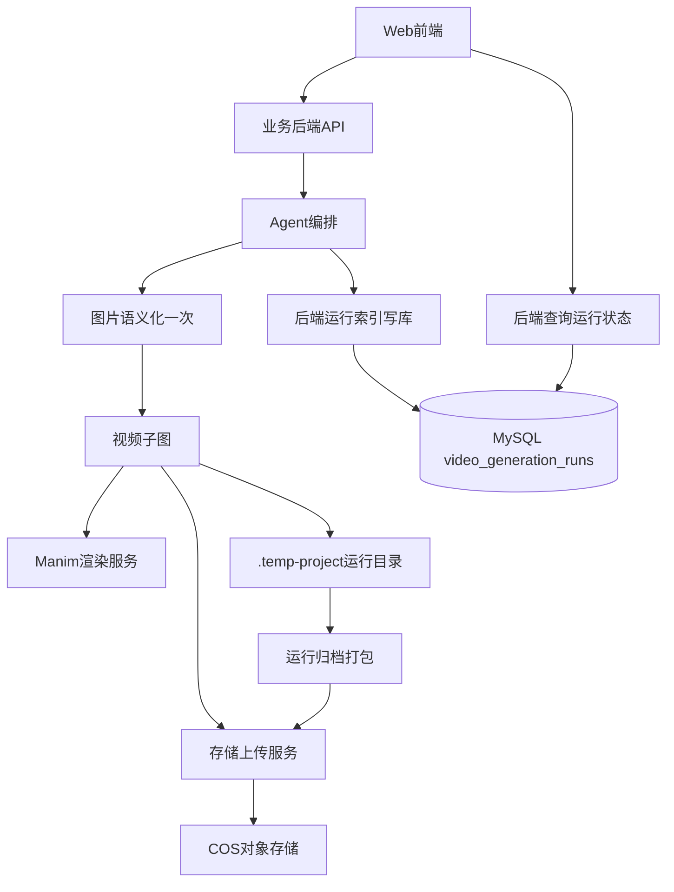

# 视频生成流程跨系统改造方案（企业级）

## 1. 结论先行

从当前业务目标（教学视频可追溯、低频查询、前端展示 URL、图片只处理一次）来看，**必须改**的不止 Agent：

- Agent：流程编排与日志产物落地（核心）
- 业务后端（server）：运行索引持久化、查询接口、鉴权与治理（核心）
- 前端（web）：触发参数、状态展示、可选运行详情入口（建议改）
- 渲染/存储服务：归档上传能力、非 mp4 文件支持（高优先）
- 运维与数据治理：生命周期、监控告警、权限审计（企业级必需）

---

## 2. 为什么需要跨系统改

如果只改 Agent，会出现几个问题：

1. **有日志但不可查询**：前端和后端没有 run_id 索引接口，线上排障仍靠人工登录机器找文件  
2. **有归档但不可治理**：没有后端状态面板，无法统计失败率、耗时、成本  
3. **有多模态优化但不可复用**：图片语义结果没有标准返回/存储协议，后续流程复用弱  
4. **缺少闭环**：业务侧看不到“这次视频生成是否完成、归档是否成功、失败在哪一步”

---

## 3. 跨系统目标架构

---

## 4. 各系统改造清单

## 4.1 Agent（必须）

- 新增运行目录写入能力（run_id / workflow_id / trace_id）
- 每个关键节点写结构化产物：
  - intent / image-semantic / storyboard / scripts / render attempts / result / manifest
- 归档打包并上传 COS
- 将 `videoUrl` 与 `artifactBundleUrl` 回传
- 意图阶段增加 `video_required` gating
- 图片语义前处理（非 OCR），只执行一次并下游复用

验收标准：

- 任意 run 可在 COS 找到完整归档
- 失败场景可通过 run_id 复现上下文

## 4.2 业务后端 Server（必须）

- 新增运行索引持久化模型（建议 `video_generation_runs`）
- 新增内部写入接口（Agent 调用）
- 新增查询接口（按 run_id / 会话 / 用户维度）
- 统一鉴权（internal token）和审计
- 保障索引写入失败不影响主链路（降级策略）

验收标准：

- 可通过 API 查询 run 状态、视频 URL、归档 URL
- 管理端/调试端可追踪完整生命周期

## 4.3 前端 Web（建议改，实际强烈建议）

- 请求侧：明确传递 `generateVideo`（已有可继续规范）
- 展示侧：
  - 主展示：`videoUrl`
  - 可选调试信息：`videoRunId`、归档状态（仅开发/管理员可见）
- 失败可解释：将后端错误摘要友好展示

验收标准：

- 用户只看到与业务相关信息，不暴露内部实现细节
- 运维/开发可在受控开关下查看 run 详情

## 4.4 Manim 渲染服务（高优先）

- 需保证脚本执行环境稳定、可复现（版本锁定）
- 返回统一错误结构（错误类型、stderr 摘要、耗时）
- 支持与 run_id 关联（便于跨系统排障）

## 4.5 存储服务（高优先）

- 除视频外，还需支持 `.json` 与 `.tar.gz` 上传
- 支持大文件超时与重试策略
- 返回稳定可访问 URL（内部/外网策略一致）

---

## 5. 数据与接口设计建议

## 5.1 `video_generation_runs` 建议字段

- 标识：`run_id`, `workflow_id`, `trace_id`, `session_id`, `user_id`
- 业务：`subject`, `status`, `video_url`
- 索引：`artifact_bundle_url`, `manifest_url`
- 调试：`intent_json`, `error_summary`
- 审计：`created_at`, `updated_at`

## 5.2 推荐接口（后端）

- `POST /api/video-runs`（内部）  
  Agent 写入/更新运行索引
- `GET /api/video-runs/:runId`（内部或管理）  
  查询单次运行详情
- `GET /api/video-runs?sessionId=&status=&page=`（管理，可选）  
  列表检索与统计

---

## 6. 分阶段实施（贴近当前业务）

### Phase A（最小可用闭环）

- Agent 产物落盘 + 归档上传
- 后端写库 `video_generation_runs`
- 前端仅展示 `videoUrl`

### Phase B（可运维）

- 后端 run 查询接口
- 前端增加管理员调试入口（run_id/状态）
- 失败原因标准化

### Phase C（企业增强）

- 预算与限流（token/渲染时长/归档大小）
- 生命周期治理（本地 TTL + COS lifecycle）
- 指标告警与回放机制

---

## 7. 你当前最该优先推进的改动

按你现在业务诉求优先级：

1. **后端 run 索引 API 与数据表稳定**（否则“日志完善”不可运营）  
2. **Agent 图片语义一次化 + video gating**（直接降本且防误触发）  
3. **存储服务支持归档上传**（形成排障闭环）  
4. **前端补最小状态展示**（业务可用）

---

## 8. 可能被忽略但很关键的点

- 隐私与合规：图片语义结果可能含敏感信息，建议脱敏策略
- 幂等性：同一 run_id 重试要可覆盖更新，避免脏数据
- 异常分层：渲染失败、上传失败、写库失败要区分状态
- 可回放：manifest 记录模型版本/提示词版本/代码版本，便于追责与回归

---

## 9. 判断是否“改够了”的标准

满足以下条件才算企业级达标：

- 用户层：能稳定拿到视频 URL  
- 研发层：能通过 run_id 快速定位任一步失败  
- 运营层：能按时间/用户/状态统计视频生成质量  
- 合规层：关键数据有访问边界与生命周期管理  

